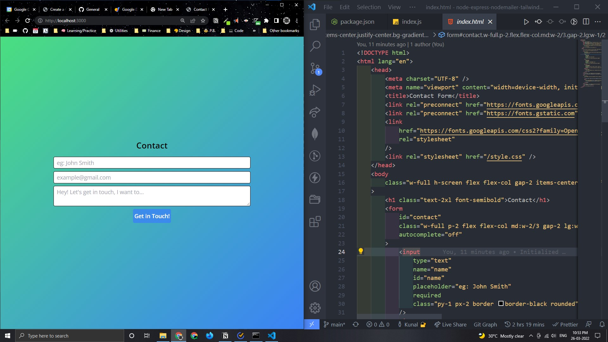

# Node, Express, Nodemailer, and TailwindCSS Contact Form Tutorial

Learn how to build a contact form with Node, Express, Nodemailer, and TailwindCSS.

## Getting Started

1. [Fork this Repo](https://github.com/Kunal-Keshan/node-express-nodemailer-tailwindcss-contact-form) or [download the latest release](https://github.com/Kunal-Keshan/node-express-nodemailer-tailwindcss-contact-form/releases/).
2. Clone it.
3. Install Node, Express, Nodemailer, and TailwindCSS with the following commands: `npm install`.
4. Run the following command to start the server: `npm start` or `npm run dev`.
5. Open your browser and go to `http://localhost:3000/`.
6. You should see a contact form.
7. Add `.env` to your project with the following contents:

```ejs
# .env
# NODEMAILER CONFIG
MAIL_EMAIL=<example@gmail.com>
MAIL_PASSWORD=<app password here>
```

8. Create a app password for your email account and make sure you have 2FA enabled. If you're not sure how to enable it, check out [this guide](https://support.google.com/accounts/answer/185833?hl=en).
9. Submit the form and you should see a confirmation email.

## Resources

### Click to Watch YouTube video

[](https://www.youtube.com/watch?v=_X-q-X-q-X-&feature=youtu.be)

### Blog Articles

#### Node, Express, Nodemailer, and TailwindCSS Contact Form Tutorial

- [Medium]()
- [Dev.to]()
- [Hashnode]()

## Output



## License

Website is available under the MIT license. See the [LICENSE](https://github.com/Kunal-Keshan/node-express-nodemailer-tailwindcss-contact-form/blob/main/LICENSE) file for more info.
